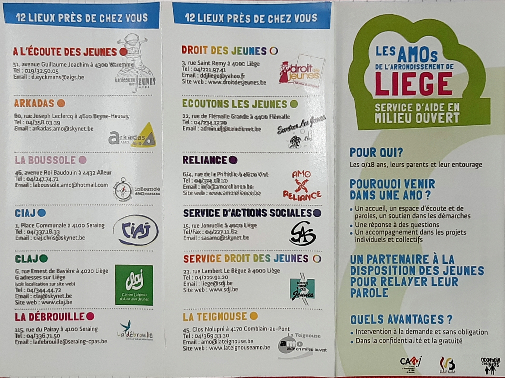
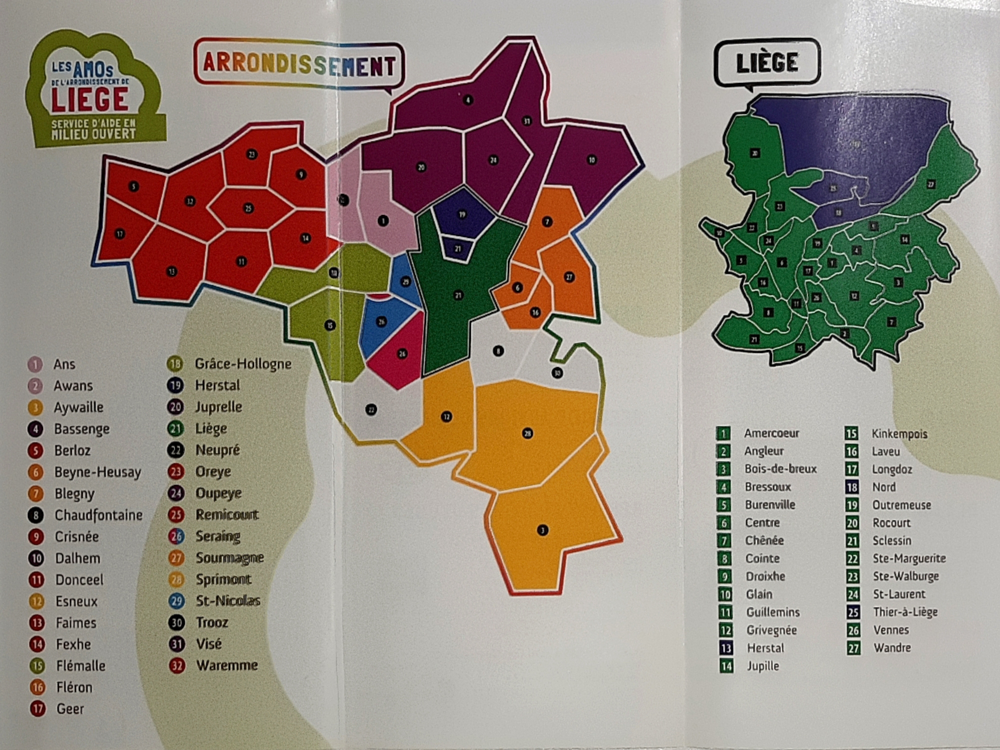

<!-- omit in toc -->
# Analyse fonctionnelle - CLAJ

- [Description](#description)
  - [Public cible (0 - 22 ans)](#public-cible-0---22-ans)
- [Analyse des fonctions](#analyse-des-fonctions)
  - [Fonctions principales](#fonctions-principales)
  - [Fonctions contraintes](#fonctions-contraintes)
    - [Liste des AMO](#liste-des-amo)
  - [Fonctions complémentaires](#fonctions-complémentaires)
- [Propositions](#propositions)

:bulb: Voir l'[analyse de la 1re demande](ReadMe.md) ou le [fichier SCRUM](SCRUM.md).

## Description

Le CLAJ est constitué des **six** centres liés à des quartiers différents de Liège et propose trois axes d'aide :

- individuel (code couleur - rouge) ;
- collectif (c. c. - blue) ;
- communautaire (c. c. - vert).

Actuellement le retour du public cible est que le site est dépassé. De plus, l'**arborescence** est trop compliquée, elle doit être plus intuitive avec des liens claires. Ainsi, la valorisation du site se fera pas uniquement par des visites et l'accès aux informations, mais également par des **redirictions** vers des autres sites.

:bulb: Attention à mettre **AMO** (*Actions en Milieu Ouvert*) partout !

### Public cible (0 - 22 ans)

Le CLAJ s'adresse à tout type de demande tant que cette dernière est faite par un(e) jeune ou en concerne un(e). Par exemple, recherche d'un club de sport, ou, une crise familliale, ou encore, demandes des écoles ou parents suite à des cas d'harcèlement ou dans un but préventif. Leur rôle principal est la **réorientation** et la **confiance** (par exemple, aide à s'intégrer dans son quartier ou le découvrir).

- 12 - 22 ans (secondaires et début supériures) ;
- familles, parents (petite enfance) ;
- organismes institutionnelles (partenaires, écoles).

## Analyse des fonctions

### Fonctions principales

- Intriguer le jeune, l'**informer** d'où il peut aller dès la page d'accueil avec l'**identification** claire des différentes antennes, trouver toutes les infos en 2-3 clics ;

- Vitrine explicative pour partenaires et écoles avec la **description du fonctionnement** et des divers services ;

- Intergration des **publications de Facebook** sur le site ;

- Garder la **cohérence** avec le design des prints, le logo avec la baseline, ainsi que la couleur verte ;

- Faire une version **responsive** ;

- Intégrer un **formulaire de contact** avec la possibilité de contacter directement l'antenne que l'on souhaite et ne pas oublier le [RGPD](https://fr.wikipedia.org/wiki/R%C3%A8glement_g%C3%A9n%C3%A9ral_sur_la_protection_des_donn%C3%A9es) ;

- Remplacer la carte interactive par **Google Map** en intégrant les images Street View pour chaque bâtiment du CLAJ ( :bulb: la photo de l'antenne dans le Carré n'est pas encore à jour) ;

- Indiquer de manière visible le **numéro d'appel d'urgence** (personne de contact : Bertrand), ainsi que les **commentaires très importants** écrits par CLAJ (par exemple, sur le COVID) ;

- Présenter les **contacts** de chaque CLAJ : infos, horaire, services, numéro de téléphone et d'urgence (personne de contact : Bertrand) ;

- Hébergement sur OVH ;

- Obtention des adresses e-mail avec le nom de domaine (6 antennes **+** +-20 personnes **+** info **+** stage).

### Fonctions contraintes

- Garder la cohérence du **puzzle** pour la page *pour qui* ;

- Créer un site adapté pour les personnes avec des **handicaps visuels** ;

- Garder l'organisation par **trois axes d'aide** (individuel, collectif et communautaire), mais enlever l'ancien code couleur ;

- Garder la liste des **partenaires** avec les liens vers leur site/Facebook, mais la compléter, notamment avec la [liste des AMO](#liste-des-partenaires-amo) et l'espace parents ;

- Le client doit pouvoir modifier **tout le contenu** ;

- Référencer **[Equinoxe FM](http://www.equinoxefm.be/)** qui est un projet / outil de CLAJ, une radio, plus concretement, sûrement sur la page des outils du centre ;

- Conserver la page des **outils** (pédagogiques) et **services** du centre pour référencer Radio, École des devoirs, etc., mais simplifiée avec un renvoie au formulaire de contact pour plus d'informations et proposition d'analyse de demande ;

- Prévoir un endroit pour le lien/picto de *Instagram* ;

- Placer les logos des subsides : *CAAJ* et *Fédération Wallonie-Bruxelles* ;

#### Liste des AMO

### Fonctions complémentaires

- Ajouter la tour de finance sur l'illustration du bannière ;

- Garder les illustrations des bâtiments ;

- Intégrer une fenêtre **chatbot** (9h - 19h) ;

- Intégrer un système de [Google Analytics](https://analytics.google.com/analytics/web/provision/#/provision).

## Propositions

- Séparation du site en trois onglets en fonction du public cible ;

- Ne plus fonctionner par code couleur pour les axes d'aide (individuel, collectif et communautaire), mais par pictos.

:bulb: Voir l'[analyse de la 1re demande](ReadMe.md) ou le [fichier SCRUM](SCRUM.md).
